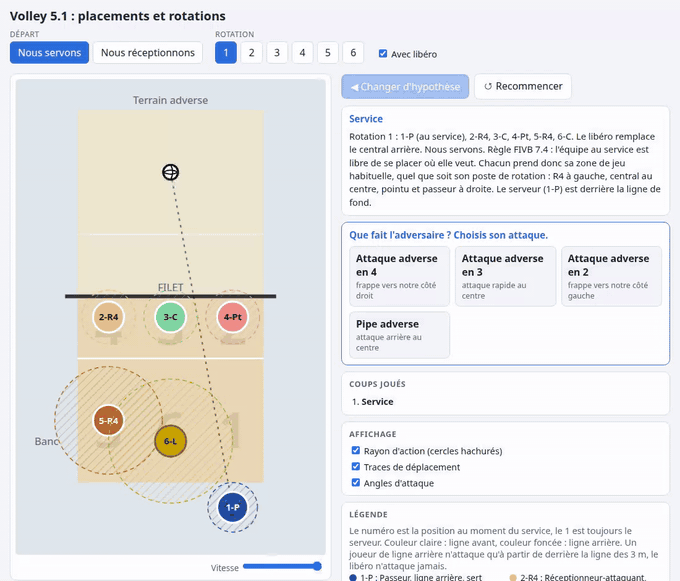

# Volley 5.1, placements animés

[](https://github.com/petitlouis/volley-51/actions/workflows/ci.yml)
[](https://github.com/petitlouis/volley-51/releases/latest)
[](LICENSE)




**[Tester en ligne](https://petitlouis.github.io/volley-51/)** ou
**[télécharger la dernière release](https://github.com/petitlouis/volley-51/releases/latest)**.

Application web pour comprendre le système 5.1 (un seul passeur) au volley, avec option libéro :
rotations, service, réception, défense et attaque. On avance coup par coup en choisissant des
hypothèses, comme aux échecs, et on voit les joueurs se déplacer.

Conçue pour Firefox, Chrome et Safari (testée jusqu'ici dans Chromium), sans serveur et sans connexion :
le résultat est un seul fichier HTML.

## Utilisation

Ouvre `dist/index.html` dans un navigateur (voir « Construire » pour le produire).

1. Choisis le départ : **Nous servons** ou **Nous réceptionnons**, la rotation (1 à 6) et le libéro.
2. À chaque coup, l'application propose des hypothèses. Clique sur l'une d'elles.
3. **Changer d'hypothèse** (ou la touche Retour arrière) revient au coup précédent. La liste
   « Coups joués » permet de revenir à n'importe quel coup.

### Nous servons

Service (placement libre, règle FIVB 7.4), attaque adverse (4, 3, 2 ou pipe), intention de l'attaquant
(ligne, grande diagonale, petite diagonale, bidouille), qui joue la balle (contre ou reprise, avec
contre gagnant ou amorti), passe du passeur, attaque avec soutien et angles d'attaque.

### Nous réceptionnons

Réception à 3, 4 ou 5 receveurs (à 3 : les deux R4 et le central arrière ou le libéro ; le pointu ne reçoit qu'à 5, en renfort), dans l'ordre de rotation obligatoire, zone visée par le serveur adverse,
receveur, passe (le pointu passe si le passeur a réceptionné), attaque avec soutien et angles.

### Lire le terrain

- Le numéro d'un rond est le **poste au moment du service** ; le 1 est toujours le serveur.
  Le joueur suit : `P` passeur, `R4a` et `R4b` les deux réceptionneurs-attaquants, `Ca` et `Cb` les deux centraux,
  `Pt` pointu, `L` libéro (numéroté comme le central qu'il remplace, par exemple `6-L`). Les lettres `a` et `b`
  identifient chaque joueur : `Ca` reste `Ca` quand la rotation change son poste (`3-Ca`, puis `2-Ca`, puis `1-Ca`).
- **Couleur claire** : ligne avant. **Couleur foncée** : ligne arrière.
- Un joueur de ligne arrière n'attaque que depuis derrière la ligne des 3 m. Le libéro n'attaque jamais.
- Cercle hachuré : rayon d'action théorique. Croix rouge : point de chute attendu. Balle blanche : sa trajectoire.

## Règles à respecter

Les règles de position viennent du règlement officiel :
[FIVB, règles officielles du volleyball 2025-2028](https://www.fivb.com/wp-content/uploads/2025/01/FIVB-Volleyball_Rules2025_2028-EN.pdf)
(page de référence : [fivb.com, Official Volleyball Rules](https://www.fivb.com/volleyball/the-game/official-volleyball-rules/)).

- **7.4 Positions** : l'équipe au service est libre de se placer ; l'équipe en réception doit être dans l'ordre de rotation au moment de la frappe.
- **12.5 Écran** : l'équipe au service ne doit pas cacher la frappe et la trajectoire du service.

Toute modification de placement doit rester conforme à ces règles.

## Développement

Prérequis : Node.js 22 ou plus récent.

### 1. Dépendances

```bash
npm install
```

Installe les dépendances (Vite, TypeScript, Vitest) dans `node_modules/`. À refaire seulement quand `package.json` change.

### 2. Vérification des types

```bash
npm run typecheck
```

Lance TypeScript en mode strict, sans rien produire : c'est le contrôle le plus rapide après une modification.

### 3. Build

```bash
npm run build
```

Vérifie les types puis produit `dist/index.html`, un fichier autonome à ouvrir directement dans un navigateur. Il n'est
pas versionné : il sert à la release GitHub et au déploiement GitHub Pages.

### 4. Tests unitaires

```bash
npm test
```

Lance Vitest sur `src/model/*.test.ts`. Les tests couvrent toutes les règles du modèle : rotations, libéro, réception,
défense, attaque et arbre d'hypothèses.

### 5. Lancer l'application

```bash
npm run dev
```

- Application : [http://localhost:5173/](http://localhost:5173/). La page se recharge toute seule quand tu modifies un fichier.
- Si le port 5173 est déjà pris (par un autre serveur Vite), Vite prend le suivant (5174, etc.) et affiche l'adresse réelle dans le terminal, à la ligne `Local:`.
- Arrête le serveur avec `Ctrl+C`.

Pour ouvrir la version construite sans serveur, ouvre `dist/index.html` après `npm run build`.

### 6. Déploiement

Trois workflows GitHub Actions, dans `.github/workflows/` :

| Workflow | Déclencheur | Rôle |
| --- | --- | --- |
| `ci.yml` | push sur `main`, pull request | Types, tests et build ; publie `dist/index.html` en artefact |
| `pages.yml` | push sur `main` | Déploie le site sur GitHub Pages |
| `release.yml` | tag `vX.Y.Z` | Crée la release GitHub avec le fichier autonome |

#### Publier une release

`dist/index.html` n'est pas versionné : c'est le fichier de la release GitHub. Le numéro de version vient de
`package.json` et s'affiche dans le pied de page de l'application. Pour publier, par exemple, la version 0.2.0 :

```bash
npm version 0.2.0 --no-git-tag-version   # met à jour package.json et package-lock.json
git add package.json package-lock.json
git commit -m "chore(release): v0.2.0"
git tag v0.2.0
git push && git push origin v0.2.0
```

Le workflow `release.yml` refuse la release si le tag ne correspond pas à `package.json`. Il vérifie ensuite les types,
lance les tests, construit, puis crée la release avec le fichier `volley-51-v0.2.0.html`.

### Structure

| Chemin | Contenu |
| --- | --- |
| `src/model/rotation.ts` | Ordre de rotation et postes |
| `src/model/roles.ts` | Rôles, étiquettes, couleurs clair/foncé |
| `src/model/libero.ts` | Remplacement du central par le libéro |
| `src/model/overlap.ts` | Ordre de rotation obligatoire en réception (règle 7.4) |
| `src/model/formations.ts` | Coordonnées de tous les placements (service, réception, défense, attaque) |
| `src/model/flow.ts` | Arbre d'hypothèses : coups, choix, trajectoire de la balle |
| `src/view/court.ts` | Rendu SVG du terrain et animations |
| `src/main.ts` | Interface |

Le modèle (`src/model`) ne dépend pas du navigateur et est entièrement couvert par des tests.
Pour corriger un placement, modifie les coordonnées dans `src/model/formations.ts`.

## Limites

Les placements de défense, de soutien et les points de chute sont des conventions courantes, pas des
règles du jeu : à ajuster selon ton équipe. Seules les règles de position au service et en réception
(FIVB 7.4) sont des règles officielles.

## Licence

MIT, voir [`LICENSE`](LICENSE) et [`LICENCES.md`](LICENCES.md).
